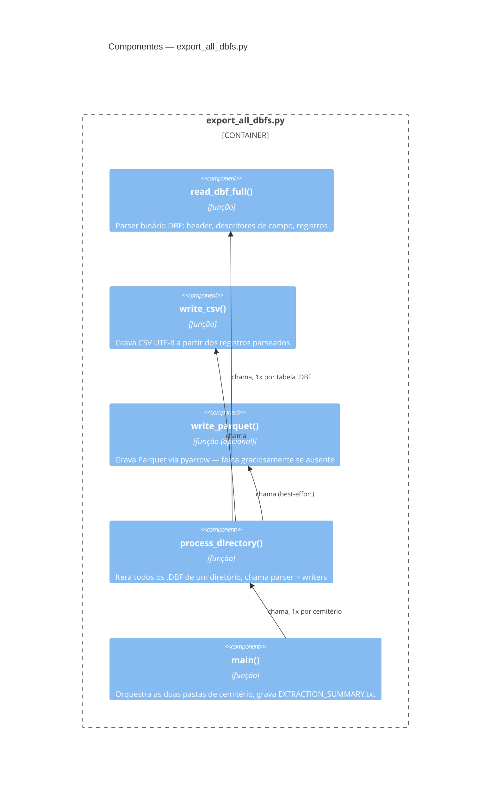
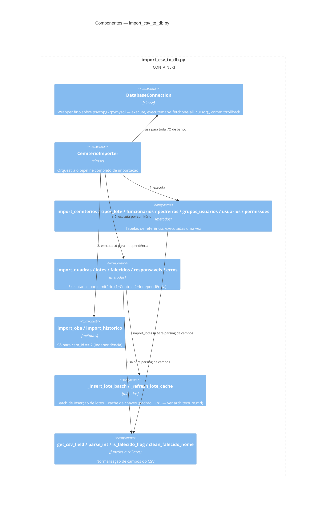

# C4 — Diagrama de Componentes (Nível 3)

> Gerado pelo Arquiteto em 2026-09-24. Cobre os dois containers com lógica não-trivial: Script de Extração e Script de Importação.

## Componentes — Script de Extração (`export_all_dbfs.py`)

## Componentes — Script de Importação (`import_csv_to_db.py`, 979 linhas)

## Notas 🟢
Estrutura de componentes confirmada por leitura direta do código-fonte (ver `code-analysis.md` para detalhamento linha a linha de cada achado).
