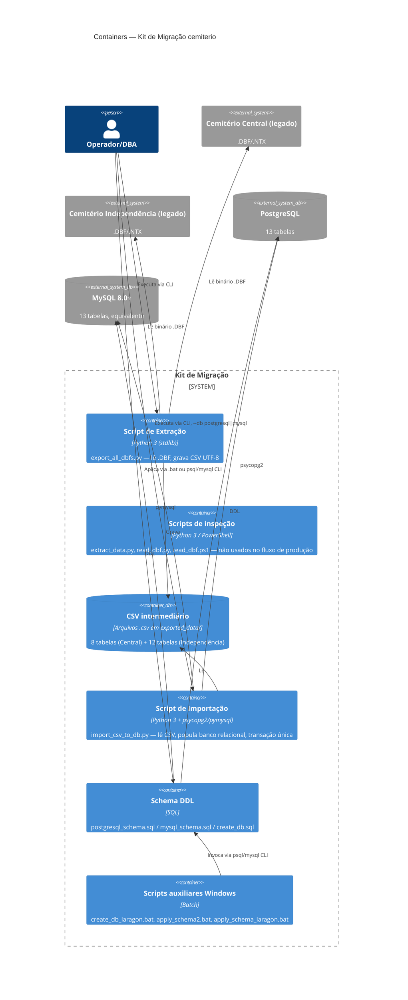

# C4 — Diagrama de Containers (Nível 2)

> Gerado pelo Arquiteto em 2026-09-24. "Container" aqui no sentido C4 (unidade implantável/executável), não Docker — este projeto não usa containerização.

## Notas 🟢

- `extracaoDebug` (scripts de inspeção) não participa do pipeline de produção — incluído no diagrama por completude, já que existe no repositório e tem lógica divergente do script de produção (ver ADR 0001).
- `csv` é um "container" de dados (filesystem), não um serviço — mantido no diagrama por ser um ponto de desacoplamento real entre extração e importação (permite reexecutar a importação sem reextrair).
- Não há container de aplicação web, API ou cache — confirmado ausentes em `inventory.md`.
