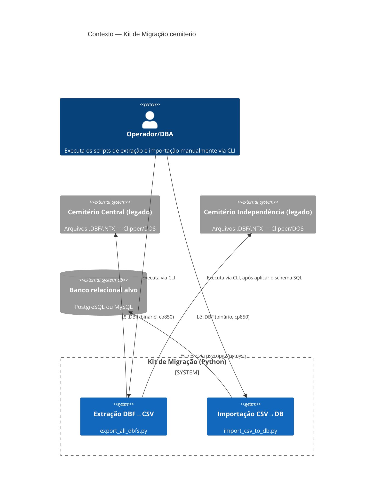

# C4 — Diagrama de Contexto (Nível 1)

> Gerado pelo Arquiteto em 2026-09-24.

## Atores e sistemas

| Elemento | Papel |
|---|---|
| Operador/DBA | Único ator humano identificado — roda os scripts manualmente, não há usuário final da aplicação legada envolvido no kit de migração em si 🟢 |
| Cemitério Central / Independência (legado) | Sistemas de origem — cada um é uma pasta isolada de arquivos `.DBF`/`.NTX` 🟢 |
| Banco relacional alvo | Sistema de destino, PostgreSQL ou MySQL à escolha do operador (`--db` no CLI) 🟢 |

🔴 LACUNA: não há indicação, nos artefatos disponíveis, de quem/o quê consome o banco alvo depois da migração (aplicação web? relatórios?) — fora do escopo desta extração, que cobre apenas o kit de migração.
