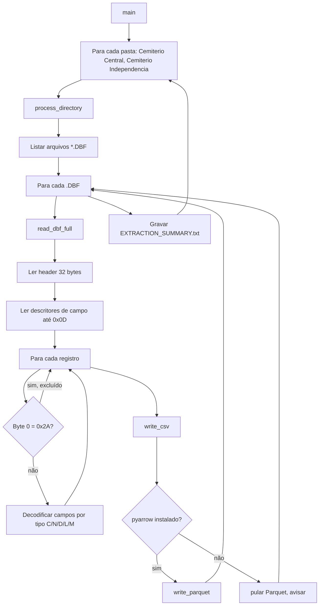

# Fluxograma — extracao-dbf

> Gerado pelo Arqueólogo em 2026-09-24. Fonte: `export_all_dbfs.py`

## Notas
- O passo `J` (byte de exclusão física `0x2A`) é distinto da exclusão lógica de negócio (`FLAG_EXCL='*'`), que só é tratada depois, na importação.
- `write_parquet` degrada graciosamente: se `pyarrow` não estiver instalado, a extração continua e só o CSV é gravado (confirmado: foi o caso nesta extração).
