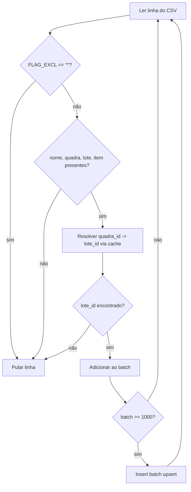

# Fluxograma — importacao-csv

> Gerado pelo Arqueólogo em 2026-09-24. Fonte: `import_csv_to_db.py`

```mermaid
flowchart TD
    A[main] --> B[Conectar ao banco --db postgresql|mysql]
    B --> C{Tabela cemiterio existe?}
    C -- não --> D[Avisar: rode o schema.sql primeiro. Sair]
    C -- sim --> E{--schema-only?}
    E -- sim --> F[Validar e sair]
    E -- não --> G[CemiterioImporter.run_full_import]

    G --> H[Tabelas de referência:\ncemiterios, tipos_lote, funcionarios,\npedreiros, grupos, usuarios, permissoes]
    H --> I[Para cada cemitério 1=Central, 2=Independência]
    I --> J[import_quadras]
    J --> K[import_lotes]
    K --> L[import_falecidos]
    L --> M[import_responsaveis]
    M --> N[import_erros]
    N --> O{cem_id == 2?}
    O -- sim --> P[import_oba + import_historico]
    O -- não --> I
    P --> I
    I --> Q[commit]
    Q --> R[print_stats]

    G -.exceção em qualquer etapa.-> S[rollback total]
```

## Sub-fluxo: import_falecidos / import_responsaveis (regra de exclusão)



## Notas
- `import_responsaveis` usa o mesmo sub-fluxo, mas o INSERT final **não é upsert** (sem `ON CONFLICT`/`ON DUPLICATE KEY`) — reexecutar duplica linhas (ver achado em `code-analysis.md`).
- Qualquer exceção em qualquer ponto do pipeline principal aciona `rollback()` da transação inteira — a importação é tudo-ou-nada.
