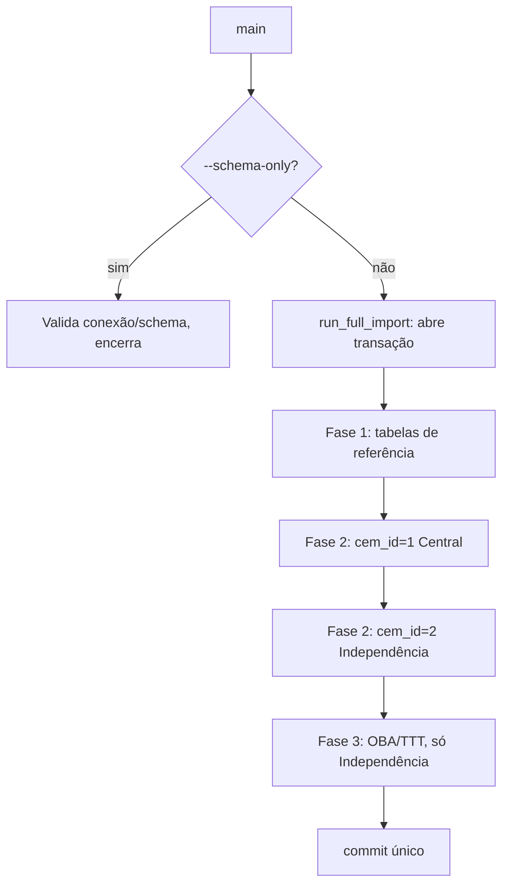
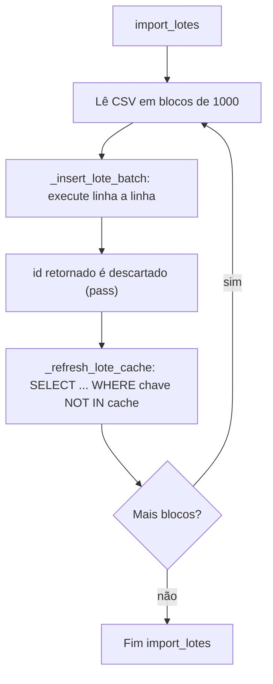
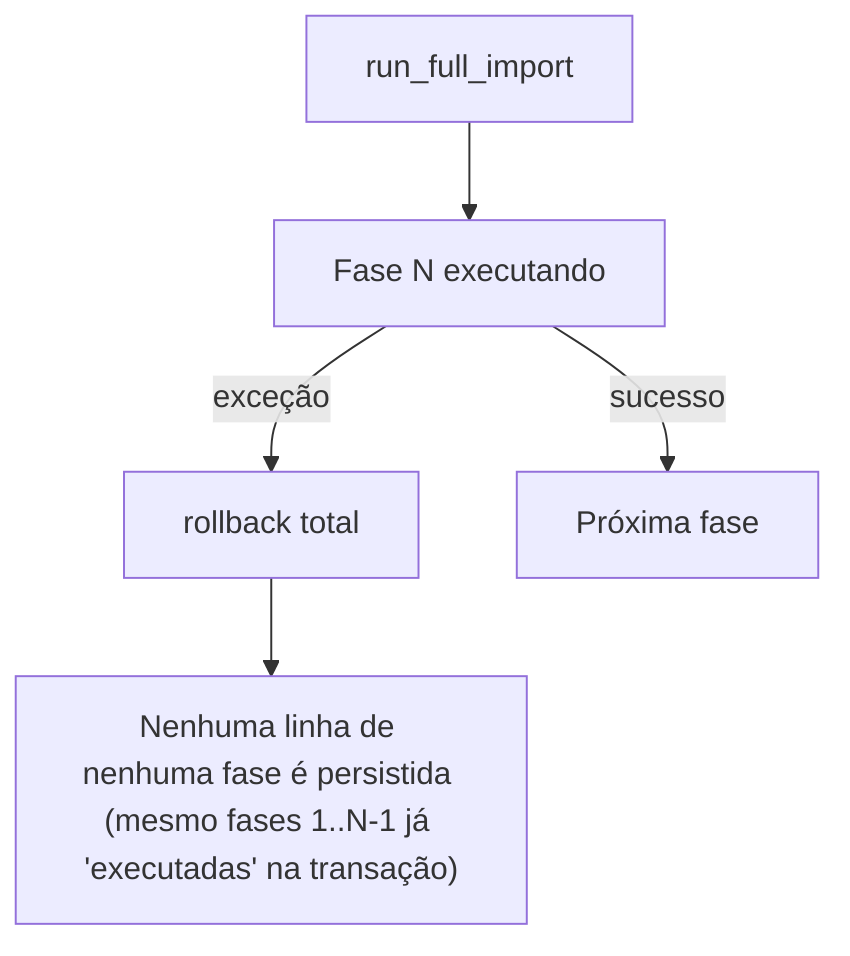
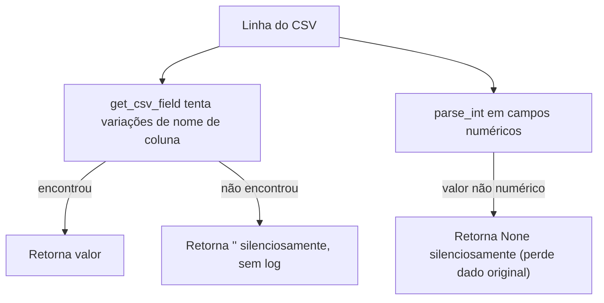

# Importação CSV, Fluxos Detalhados

> Gerado pelo Redator em 2026-09-24. Complementa `design.md` com os fluxos que não cabem no "Fluxo Principal" resumido.

## Fluxo A — Importação completa (happy path)

## Fluxo B — Importação de lotes (batch + cache)

🟡 Este padrão é O(n²) porque `_refresh_lote_cache` compara contra o cache completo a cada bloco — não crítico no volume atual, mas cresce com o dataset.

## Fluxo C — Erro em qualquer fase (rollback total)

## Fluxo D — Tradução de campos com fallback silencioso

🔴 Ambos os fallbacks (`get_csv_field`, `parse_int`) perdem dado sem registrar nada — risco de auditoria se um CSV futuro tiver variações de formato não previstas.
