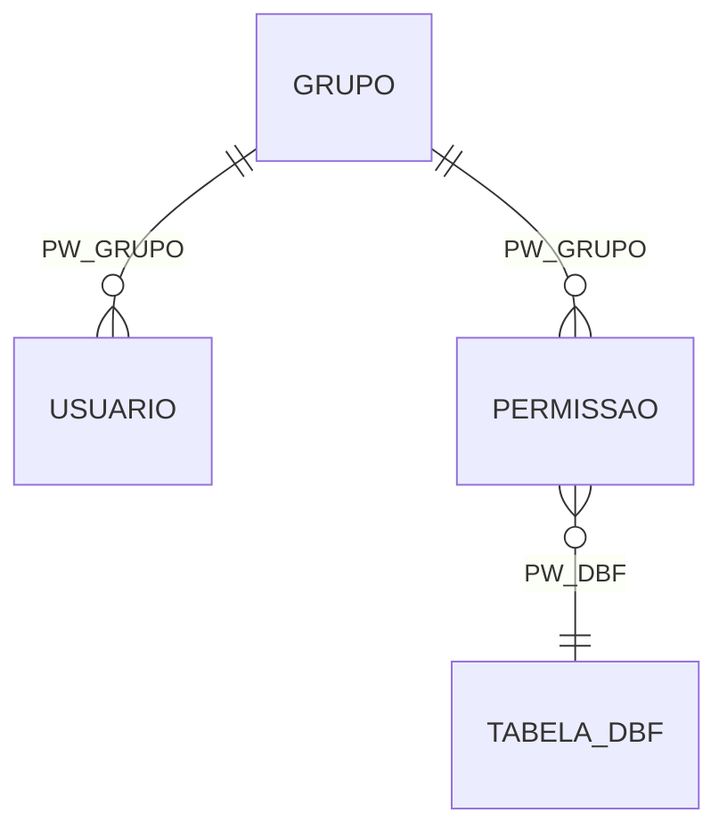

# Matriz de Permissões (RBAC) — Sistema de Gestão de Cemitérios

> Gerado pelo Detetive em 2026-09-24. Fonte: `PWUSUA.DBF`, `PWGRUPOS.DBF`, `PWTABELA.DBF` de cada cemitério (via `code-analysis.md`/`data-dictionary.md` do Arqueólogo) e `import_csv_to_db.py`.

## Modelo confirmado 🟢

RBAC simples por grupo, **independente por cemitério**: cada `Cemiterio */PWUSUA.DBF` tem seus próprios usuários, vinculados a um grupo definido em `PWGRUPOS.DBF`. Permissões por grupo+tabela ficam em `PWTABELA.DBF`.

## Papéis identificados

| Nível (`PW_NIVEL`) | Papel | Descrição |
|---|---|---|
| `1` | Administrador | Acesso total 🟢 |
| `2` | Operador | Incluir/alterar/consultar 🟢 |
| `3` | Consultor | Apenas consultar/relatório 🟢 |
| outros | Perfis customizados | 🟡 não observados nos dados desta extração (só 2 usuários por cemitério) |

## Matriz de Permissões por Tabela

`PW_PERMIS` é uma string de 20 caracteres, decodificada como 5 blocos de 4 (`'S' in bloco` → permitido). 🟡 INFERIDO — o próprio comentário no código-fonte original tem um ponto de interrogação, indicando incerteza do autor sobre o mapeamento exato de posições.

| Bloco (posição) | Ação legada | Permissão no modelo alvo |
|---|---|---|
| 0–3 | Incluir | `pode_incluir` |
| 4–7 | Alterar | `pode_alterar` |
| 8–11 | Excluir | `pode_excluir` |
| 12–15 | Consultar | `pode_consultar` |
| 16–19 | Relatório | `pode_relatorio` |

**Escopo:** 1 grupo por cemitério nos dados observados (dados de grupo corrompidos por encoding em uma das extrações), 6 registros de permissão por tabela DBF, por cemitério.

## 🔴 Achados críticos de segurança

### SEC-001 — Senha em texto puro no legado
`PWUSUA.PW_PASS` é `CHAR(6)`, armazenada **sem qualquer hash ou criptografia** no sistema original. Qualquer pessoa com acesso ao arquivo `.DBF` lê a senha diretamente.

### SEC-002 — Hash de migração inadequado para produção
A migração aplica `senha_hash = SHA256(senha)` **sem salt**. O comentário original no código já reconhece isso: *"Hash simples para migração (substituir por bcrypt/argon2 na aplicação real)"*. Isto não é apenas um placeholder teórico — é o valor efetivamente persistido em `usuario.senha_hash` na base migrada hoje. SHA256 sem salt é vulnerável a rainbow tables e é significativamente mais fraco que bcrypt/argon2/scrypt para senhas de até 6 caracteres (espaço de busca pequeno o suficiente para força bruta completa).
**Recomendação:** antes de qualquer uso em produção do sistema alvo, reprocessar `usuario.senha_hash` com um algoritmo de hash de senha adequado (bcrypt/argon2) e forçar reset de senha no primeiro login, já que a senha original de 6 caracteres é fraca por natureza independente do hash.

### SEC-003 — Colisão de identidade entre cemitérios
O legado mantém bases de usuários **independentes por cemitério** (`PWUSUA.DBF` de cada pasta). O schema alvo trata `usuario`/`usuario_grupo` como tabelas **globais** (sem `cemiterio_id`), e `usuario.codigo` é `CHAR(4) PRIMARY KEY`. Se o mesmo código de 4 dígitos existir nos dois cemitérios — plausível, dado o universo pequeno de códigos — o upsert (`ON CONFLICT ... DO UPDATE`) do segundo cemitério importado **sobrescreve silenciosamente** o usuário do primeiro, sem erro nem log.
**Requer decisão do usuário:** confirmar se os operadores das duas unidades são de fato a mesma pessoa/login compartilhado, ou se são identidades independentes que colidem por acaso de numeração. Essa resposta muda a estratégia de migração (merge vs. namespace separado por cemitério).

### SEC-004 — Mesmo problema estrutural em funcionario/pedreiro
`funcionario` e `pedreiro` no schema alvo também são tabelas globais sem `cemiterio_id`, mas os códigos de coveiro/pedreiro **são** numerados de forma independente por cemitério no legado (confirmado: Central tem código `4`=RAFAEL STARON, Independência tem código `9`=ERIANDRO JOSE RIBAS — universos de código totalmente diferentes, não coincidentes). Isso já está sendo mascarado hoje pelo uso de uma lista hardcoded incorreta no importador (ver RN012 em `domain.md`); ao corrigir o hardcode, a colisão de código entre cemitérios se tornará um problema real de integridade referencial (`coveiro_id`/`pedreiro_id` apontando para a pessoa errada). Ver ADR 0004.

## Lacunas

- 🔴 Não há evidência, nos artefatos disponíveis, de como (ou se) a aplicação Clipper original impunha essas permissões em tempo de execução — o `PWTABELA.DBF` descreve a matriz de dados, mas o código da aplicação Clipper em si não está no escopo desta extração (só os scripts de migração).
