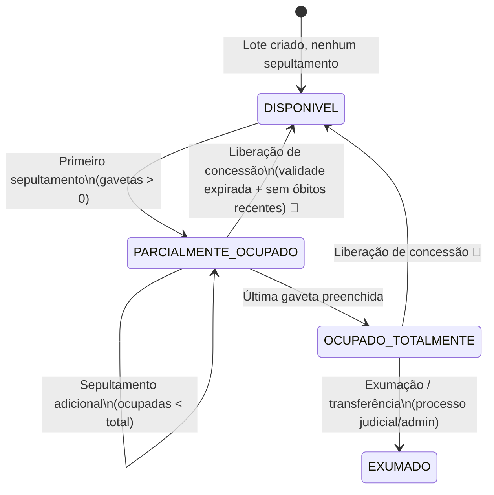
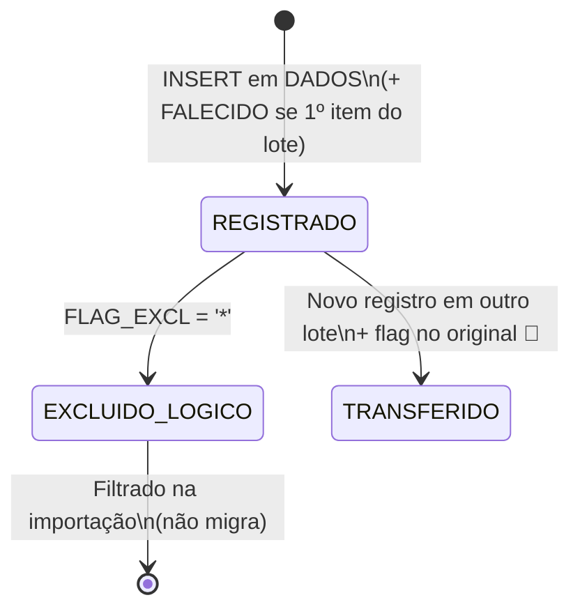
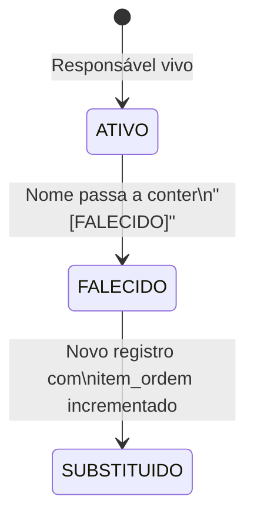

# Máquinas de Estado — Sistema de Gestão de Cemitérios

> Gerado pelo Detetive em 2026-09-24. Fonte: `code-analysis.md`, `data-dictionary.md` e inspeção dos campos de status implícitos (o legado não declara um campo `status` explícito para nenhuma destas entidades — os estados abaixo são **inferidos** a partir de combinações de campos e do fluxo dos scripts de importação).

## Lote / Jazigo

Estado não é um campo explícito no legado — é derivado da comparação entre `LOTES.GAVETA` (capacidade) e a contagem de sepultamentos ativos naquele lote em `DADOS`. 🟡 INFERIDO

| Transição | Evento | Condição | Ação nos dados |
|---|---|---|---|
| DISPONÍVEL → PARCIALMENTE_OCUPADO | Primeiro sepultamento | `gavetas > 0` | Insere em `DADOS`, indexa em `FALECIDO` |
| PARCIALMENTE_OCUPADO → PARCIALMENTE_OCUPADO | Sepultamento adicional | ocupadas < `gavetas` | Incrementa `item_ordem` |
| PARCIALMENTE_OCUPADO → OCUPADO_TOTALMENTE | Última gaveta preenchida | ocupadas = `gavetas` | — |
| OCUPADO_TOTALMENTE → EXUMADO | Exumação/transferência | processo judicial/administrativo | Remove de `DADOS`/`FALECIDO` 🔴 LACUNA: mecanismo exato de exumação não está implementado em nenhum script analisado — inferido do modelo de dados, não observado em código |
| QUALQUER → DISPONÍVEL | Liberação de concessão | validade expirada + sem óbitos recentes | 🔴 LACUNA: regra de liberação não encontrada em nenhum script; só é plausível pela existência do campo `validade` em `lote` |

### Regras de validade associadas
- **Tipo `1` (Comum/Temporário):** validade finita → após expiração, lote é elegível para liberação. 🟡
- **Tipo `3` (Gaveta/Perpétuo):** validade `NULL`/`'1111-11-11'` → nunca expira. 🟢 (confirmado pela regra de conversão de datas especiais, RN006 em `domain.md`)
- **Renovação:** seria refletida em `lote.validade` + histórico em `lote_historico_validade` (só Independência, origem `TTT.DBF`). 🟡

## Sepultamento (registro em `DADOS`)

| Evento | Ação | Registros afetados |
|---|---|---|
| Registro inicial | INSERT `DADOS` (+ `FALECIDO` se 1º item do lote) | `DADOS`, `FALECIDO`, `RESPONSA` |
| Marcar excluído | `FLAG_EXCL = '*'` | `DADOS` (soft delete — ver RN005) |
| Transferência | Novo registro em outro lote + flag no original | `DADOS` (2 registros) 🔴 LACUNA: mecanismo de "flag no original" para sinalizar transferência não foi encontrado em nenhum script — pode ser um processo manual/administrativo fora do sistema Clipper, não uma feature de software |

🟡 Nota geral: como o legado não expõe transições via API/log de eventos, este diagrama é reconstruído a partir da forma dos dados (quais campos existem, quais combinações aparecem), não de um rastro de execução observado.

## Responsável / Concessionário

- Um lote pode ter múltiplos responsáveis ao longo do tempo (`item_ordem` sequencial). 🟢
- Responsável falecido mantém vínculo histórico, mas o sistema não tem lógica observada de "parar notificações" (não há subsistema de notificação no legado). 🟡
- Substituição é modelada como um novo registro, não como update do existente — preserva histórico por natureza do modelo (append-only por `item_ordem`), não por decisão explícita de auditoria encontrada em código. 🟡

## Lacunas gerais desta seção

- 🔴 Nenhum dos três diagramas acima corresponde a um campo `status` explícito no legado — todos foram inferidos da combinação de campos e do comportamento do importador. Recomenda-se validar com um usuário operacional do sistema Clipper antes de usar estes diagramas como contrato para o sistema novo.
- 🔴 Mecanismo de exumação/transferência de sepultamento não está implementado em nenhum script disponível nesta extração — pode ser um processo manual (fora do sistema) ou pode existir em uma tela do Clipper não coberta pelos scripts analisados (o legado é a aplicação Clipper completa; os scripts analisados aqui são apenas o pipeline de migração, não a aplicação original).
