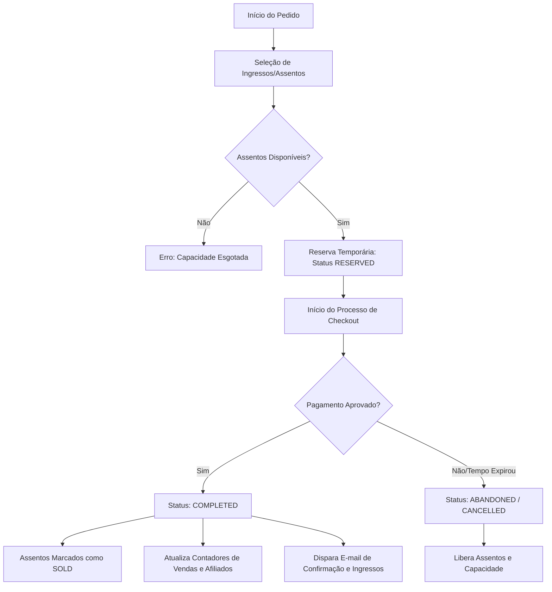

# Fluxograma: Módulo Orders

```mermaid
flowchart TD
    A[Início do Pedido] --> B[Seleção de Ingressos/Assentos]
    B --> C{Assentos Disponíveis?}
    C -- Não --> D[Erro: Capacidade Esgotada]
    C -- Sim --> E[Reserva Temporária: Status RESERVED]
    E --> F[Início do Processo de Checkout]
    F --> G{Pagamento Aprovado?}
    G -- Sim --> H[Status: COMPLETED]
    H --> I[Assentos Marcados como SOLD]
    H --> J[Atualiza Contadores de Vendas e Afiliados]
    H --> K[Dispara E-mail de Confirmação e Ingressos]
    G -- Não/Tempo Expirou --> L[Status: ABANDONED / CANCELLED]
    L --> M[Libera Assentos e Capacidade]
```
