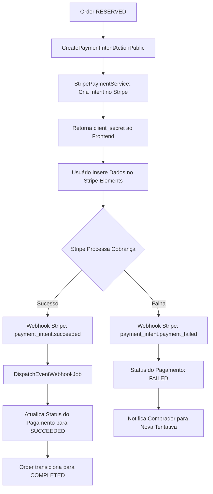

# Fluxograma: Módulo Payments

```mermaid
flowchart TD
    A[Order RESERVED] --> B[CreatePaymentIntentActionPublic]
    B --> C[StripePaymentService: Cria Intent no Stripe]
    C --> D[Retorna client_secret ao Frontend]
    D --> E[Usuário Insere Dados no Stripe Elements]
    E --> F{Stripe Processa Cobrança}
    F -- Sucesso --> G[Webhook Stripe: payment_intent.succeeded]
    G --> H[DispatchEventWebhookJob]
    H --> I[Atualiza Status do Pagamento para SUCCEEDED]
    I --> J[Order transiciona para COMPLETED]
    F -- Falha --> K[Webhook Stripe: payment_intent.payment_failed]
    K --> L[Status do Pagamento: FAILED]
    L --> M[Notifica Comprador para Nova Tentativa]
```
