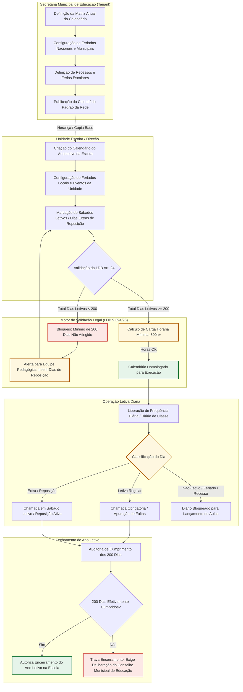

# Fluxo de Engenharia Reversa: Calendário Escolar e Dias Letivos (`Calendario`)

```mermaid
flowchart TD
    subgraph SME["Secretaria Municipal de Educação (Tenant)"]
        A1[Definição da Matriz Anual do Calendário] --> A2[Configuração de Feriados Nacionais e Municipais]
        A2 --> A3[Definição de Recessos e Férias Escolares]
        A3 --> A4[Publicação do Calendário Padrão da Rede]
    end

    subgraph Escola["Unidade Escolar / Direção"]
        B1[Criação do Calendário do Ano Letivo da Escola]
        A4 -.->|Herança / Cópia Base| B1
        B1 --> B2[Configuração de Feriados Locais e Eventos da Unidade]
        B2 --> B3[Marcação de Sábados Letivos / Dias Extras de Reposição]
        B3 --> B4{Validação da LDB Art. 24}
    end

    subgraph RegrasLDB["Motor de Validação Legal (LDB 9.394/96)"]
        B4 -->|Total Dias Letivos < 200| C1[Bloqueio: Mínimo de 200 Dias Não Atingido]
        C1 --> C2[Alerta para Equipe Pedagógica Inserir Dias de Reposição]
        C2 --> B3

        B4 -->|Total Dias Letivos >= 200| D1[Cálculo de Carga Horária Mínima: 800h+]
        D1 -->|Horas OK| E1[Calendário Homologado para Execução]
    end

    subgraph Operacao["Operação Letiva Diária"]
        E1 --> F1[Liberação de Frequência Diária / Diário de Classe]
        F1 --> F2{Classificação do Dia}
        F2 -->|Letivo Regular| G1[Chamada Obrigatória / Apuração de Faltas]
        F2 -->|Extra / Reposição| G2[Chamada em Sábado Letivo / Reposição Ativa]
        F2 -->|Não-Letivo / Feriado / Recesso| G3[Diário Bloqueado para Lançamento de Aulas]
    end

    subgraph Encerramento["Fechamento do Ano Letivo"]
        G1 & G2 --> H1[Auditoria de Cumprimento dos 200 Dias]
        H1 --> H2{200 Dias Efetivamente Cumpridos?}
        H2 -->|Sim| H3[Autoriza Encerramento do Ano Letivo na Escola]
        H2 -->|Não| H4[Trava Encerramento: Exige Deliberação do Conselho Municipal de Educação]
    end

    classDef valid fill:#e6f4ea,stroke:#137333,stroke-width:2px;
    classDef warning fill:#fef7e0,stroke:#b06000,stroke-width:2px;
    classDef error fill:#fce8e6,stroke:#c5221f,stroke-width:2px;
    class E1,H3 valid;
    class C2,D1,F2 warning;
    class C1,H4 error;
```
