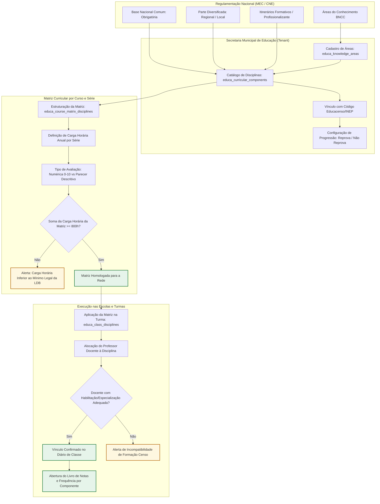

# Fluxo de Engenharia Reversa: Componentes Curriculares e Matriz BNCC (`ComponenteCurricular`)

```mermaid
flowchart TD
    subgraph BNCC_MEC["Regulamentação Nacional (MEC / CNE)"]
        A1[Áreas do Conhecimento BNCC]
        A2[Base Nacional Comum: Obrigatória]
        A3[Parte Diversificada: Regional / Local]
        A4[Itinerários Formativos / Profissionalizante]
    end

    subgraph GestaoRede["Secretaria Municipal de Educação (Tenant)"]
        A1 --> B1[Cadastro de Áreas: educa_knowledge_areas]
        A2 & A3 & A4 --> B2[Catálogo de Disciplinas: educa_curricular_components]
        B1 --> B2
        B2 --> B3[Vínculo com Código Educacenso/INEP]
        B3 --> B4[Configuração de Progressão: Reprova / Não Reprova]
    end

    subgraph MatrizCurricular["Matriz Curricular por Curso e Série"]
        B2 --> C1[Estruturação da Matriz: educa_course_matrix_disciplines]
        C1 --> C2[Definição de Carga Horária Anual por Série]
        C2 --> C3[Tipo de Avaliação: Numérica 0-10 vs Parecer Descritivo]
        C3 --> C4{Soma da Carga Horária da Matriz >= 800h?}
        C4 -->|Não| C5[Alerta: Carga Horária Inferior ao Mínimo Legal da LDB]
        C4 -->|Sim| C6[Matriz Homologada para a Rede]
    end

    subgraph TurmaDocente["Execução nas Escolas e Turmas"]
        C6 --> D1[Aplicação da Matriz na Turma: educa_class_disciplines]
        D1 --> D2[Alocação do Professor Docente à Disciplina]
        D2 --> D3{Docente com Habilitação/Especialização Adequada?}
        D3 -->|Sim| D4[Vínculo Confirmado no Diário de Classe]
        D3 -->|Não| D5[Alerta de Incompatibilidade de Formação Censo]
        D4 --> E1[Abertura do Livro de Notas e Frequência por Componente]
    end

    classDef valid fill:#e6f4ea,stroke:#137333,stroke-width:2px;
    classDef warning fill:#fef7e0,stroke:#b06000,stroke-width:2px;
    classDef error fill:#fce8e6,stroke:#c5221f,stroke-width:2px;
    class C6,D4,E1 valid;
    class C5,D5 warning;
```
