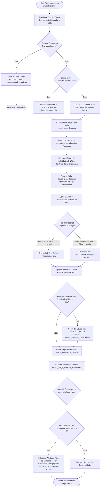

# Fluxograma de Diário de Classe, Frequência e Conteúdos Ministrados

> Módulo: DailyRecord / Attendance / AbsenceJustification
> Contexto: SYSGOV / SYS-Educa (Migração de I-Educar legado)

```mermaid
flowchart TD
    %% Nós de Início e Seleção
    Start([Início: Professor acessa Diário Eletrônico]) --> SelectContext[Selecionar Escola, Turma, Componente Curricular e Data]
    SelectContext --> CheckLock{Data ou Etapa com<br/>Travamento Ativo?}
    
    CheckLock -- Sim --> LockAlert[Alerta: Período Letivo Bloqueado para Lançamentos Retroativos]
    LockAlert --> Terminate([Operação Bloqueada])

    CheckLock -- Não --> CheckTimetable{Existe Slot no<br/>Quadro de Horários?}
    CheckTimetable -- Sim --> AutoFillSlot[Preencher Horário e Ordem da Aula via educa_timetable_slots]
    CheckTimetable -- Não --> ManualClassType[Definir Tipo: Aula Extra / Reposição de Sábado Letivo]

    AutoFillSlot --> LessonForm[Formulário de Registro de Aula<br/>educa_class_lessons]
    ManualClassType --> LessonForm

    %% Conteúdo e BNCC
    LessonForm --> FillContent[Preencher Conteúdo Ministrado, Metodologia e Recursos]
    FillContent --> SelectBNCC[Vincular Códigos de Habilidades BNCC e Objetivos de Aprendizagem]
    SelectBNCC --> SaveLesson[Persistir Aula: educa_class_lessons<br/>Status: DRAFT ou FINALIZED]

    %% Chamada e Apuração de Frequência
    SaveLesson --> LoadStudents[Carregar Alunos Matriculados e Ativos na Turma]
    LoadStudents --> CheckPresenceType{Tipo de Presença<br/>Regra de Avaliação}
    
    CheckPresenceType -- Geral: Anos Iniciais / Ed. Infantil --> GeneralRoll[Chamada Diária Global: Presença no Dia]
    CheckPresenceType -- Por Componente: Anos Finais / Médio --> DiscRoll[Chamada por Componente: Falta por Hora-Aula]

    GeneralRoll --> MarkStatus[Apontar Status por Aluno: PRESENT ou ABSENT]
    DiscRoll --> MarkStatus

    %% Justificativa de Faltas e Atestados
    MarkStatus --> CheckJustification{Aluno possui Atestado /<br/>Justificativa Vigente no Dia?}
    CheckJustification -- Sim --> ApplyJustified[Converter Status para JUSTIFIED_ABSENT<br/>Vincular educa_absence_justifications]
    CheckJustification -- Não --> PersistAttendance[Salvar Registros em Lote:<br/>educa_attendance_records]
    ApplyJustified --> PersistAttendance

    %% Consolidação e Alertas
    PersistAttendance --> SyncSummary[Atualizar Resumo da Etapa:<br/>educa_stage_absence_summaries]
    
    SyncSummary --> CalcPercentage{Calcular Frequência %<br/>Acumulada do Aluno}
    CalcPercentage --> CheckLDB{Frequência < 75%<br/>ou Faltas Consecutivas > 5?}

    CheckLDB -- Sim --> EvasionWarning[🚨 Disparar Alerta de Risco de Evasão Escolar<br/>Notificação Pedagógica / Ficha FICAI Conselho Tutelar]
    CheckLDB -- Não --> NormalFlow[Registro Regular em Conformidade]

    EvasionWarning --> EndSuccess([Diário e Frequência Registrados])
    NormalFlow --> EndSuccess
```
