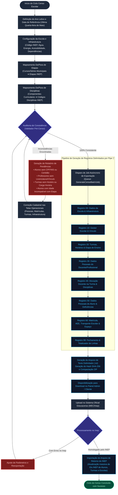

# Fluxo Operacional: Módulo Educacenso (Exportações Regulatórias MEC/Inep)

```mermaid
graph TD
    %% Nós de Início e Configuração
    Start(["Início do Ciclo Censo Escolar"]) --> DefineAno["Definição do Ano Letivo e Data de Referência (Última Quarta-feira de Maio)"]
    DefineAno --> ConfigEscola["Configuração da Escola e Infraestrutura<br/>(Código INEP, Água, Energia, Acessibilidade, Dependências)"]

    %% Nós de Mapeamento Curricular
    ConfigEscola --> MapeamentoEtapas["Mapeamento De/Para de Etapas<br/>(Cursos/Séries Municipais ➔ Etapas INEP)"]
    MapeamentoEtapas --> MapeamentoDisciplinas["Mapeamento De/Para de Disciplinas<br/>(Componentes Curriculares ➔ Códigos Disciplinas INEP)"]

    %% Validação Prévia (Regras de Consistência)
    MapeamentoDisciplinas --> AuditoriaPrevia{"Auditoria de Consistência<br/>(Validador Pré-Censo)"}
    
    AuditoriaPrevia -- "Inconsistências Encontradas" --> RelatorioPendencias["Geração de Relatório de Pendências<br/>• Alunos sem CPF/NIS ou Certidão<br/>• Professores sem Licenciatura/Vínculo<br/>• Turmas sem Horário ou Carga Horária<br/>• Alunos com Idade Incompatível com Etapa"]
    RelatorioPendencias --> CorrecaoCadastral["Correção Cadastral nas Telas Operacionais<br/>(Pessoas, Matrículas, Turmas, Infraestrutura)"]
    CorrecaoCadastral --> AuditoriaPrevia

    AuditoriaPrevia -- "100% Consistente" --> DispatchJob["Disparo de Job Assíncrono de Exportação<br/>(Queue: GenerateCensoBatchJob)"]

    %% Pipeline de Geração dos Registros
    subgraph PipelineGeracao ["Pipeline de Geração de Registros Delimitados por Pipe '|'"]
        DispatchJob --> Reg00["Registro 00: Dados da Escola & Infraestrutura"]
        Reg00 --> Reg10["Registro 10: Gestor Escolar & Vínculo"]
        Reg10 --> Reg20["Registro 20: Turmas, Horários & Etapa de Ensino"]
        Reg20 --> Reg30["Registro 30: Dados Pessoais do Docente/Profissional"]
        Reg30 --> Reg40["Registro 40: Alocação Docente na Turma & Disciplinas"]
        Reg40 --> Reg50["Registro 50: Dados Pessoais do Aluno & Deficiências"]
        Reg50 --> Reg60["Registro 60: Matrícula, AEE, Transporte Escolar & Espaço"]
        Reg60 --> Reg99["Registro 99: Fechamento & Totalizador de Linhas"]
    end

    %% Empacotamento e Download
    Reg99 --> GerarArquivo["Geração do Arquivo de Texto Delimitado (.txt)<br/>Geração do Hash SHA-256 e Compactação ZIP"]
    GerarArquivo --> DownloadSaaS["Disponibilização para Download no Painel Admin / Cliente"]
    DownloadSaaS --> SubmissaoInep["Upload no Sistema Oficial Educacenso (MEC/Inep)"]

    %% Retorno do INEP
    SubmissaoInep --> RetornoInep{"Processamento no Inep"}
    RetornoInep -- "Com Erros no Inep" --> AnaliseErroInep["Ajuste de Parâmetros e Reexportação"]
    AnaliseErroInep --> AuditoriaPrevia
    
    RetornoInep -- "Homologado pelo INEP" --> ImportRetorno["Importação do Arquivo de Retorno do INEP<br/>(Atualização massiva de IDs INEP de Alunos, Turmas e Escolas)"]
    ImportRetorno --> Fim(["Ciclo do Censo Concluído com Sucesso"])

    %% Estilos
    classDef default fill:#1E293B,stroke:#475569,stroke-width:1px,color:#F8FAFC;
    classDef process fill:#0F172A,stroke:#38BDF8,stroke-width:2px,color:#38BDF8;
    classDef decision fill:#312E81,stroke:#818CF8,stroke-width:2px,color:#C7D2FE;
    classDef alert fill:#7F1D1D,stroke:#F87171,stroke-width:2px,color:#FECACA;
    classDef success fill:#064E3B,stroke:#34D399,stroke-width:2px,color:#A7F3D0;

    class Start,DefineAno,ConfigEscola,MapeamentoEtapas,MapeamentoDisciplinas,CorrecaoCadastral,DispatchJob default;
    class Reg00,Reg10,Reg20,Reg30,Reg40,Reg50,Reg60,Reg99,GerarArquivo,DownloadSaaS,ImportRetorno process;
    class AuditoriaPrevia,RetornoInep decision;
    class RelatorioPendencias,AnaliseErroInep alert;
    class Fim success;
```
