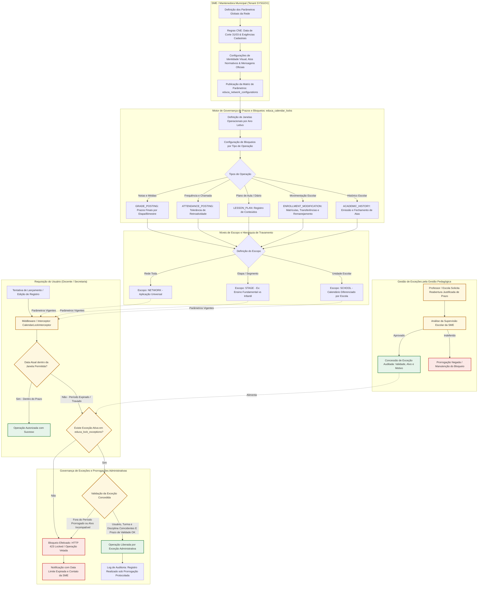

# Fluxo de Engenharia Reversa: Parametrizações Globais e Bloqueio de Prazos (`Configuracao`)

```mermaid
flowchart TD
    subgraph Mantenedora["SME / Mantenedora Municipal (Tenant SYSGOV)"]
        A1[Definição dos Parâmetros Globais da Rede] --> A2[Regras CNE: Data de Corte 31/03 & Exigências Cadastrais]
        A2 --> A3[Configurações de Identidade Visual, Atos Normativos & Mensagens Oficiais]
        A3 --> A4[Publicação da Matriz de Parâmetros: educa_network_configurations]
    end

    subgraph MotorBloqueio["Motor de Governança de Prazos e Bloqueios: educa_calendar_locks"]
        A4 --> B1[Definição de Janelas Operacionais por Ano Letivo]
        B1 --> B2[Configuração de Bloqueios por Tipo de Operação]
        B2 --> B3{Tipos de Operação}
        B3 -->|Notas e Médias| C1[GRADE_POSTING: Prazos Finais por Etapa/Bimestre]
        B3 -->|Frequência e Chamada| C2[ATTENDANCE_POSTING: Tolerância de Retroatividade]
        B3 -->|Plano de Aula / Diário| C3[LESSON_PLAN: Registro de Conteúdos]
        B3 -->|Movimentação Escolar| C4[ENROLLMENT_MODIFICATION: Matrículas, Transferências e Remanejamento]
        B3 -->|Histórico Escolar| C5[ACADEMIC_HISTORY: Emissão e Fechamento de Atas]
    end

    subgraph EscoposBloqueio["Níveis de Escopo e Hierarquia de Travamento"]
        C1 & C2 & C3 & C4 & C5 --> D1{Definição do Escopo}
        D1 -->|Rede Toda| E1[Escopo: NETWORK - Aplicação Universal]
        D1 -->|Etapa / Segmento| E2[Escopo: STAGE - Ex: Ensino Fundamental vs Infantil]
        D1 -->|Unidade Escolar| E3[Escopo: SCHOOL - Calendário Diferenciado por Escola]
    end

    subgraph Interceptor["Requisição do Usuário (Docente / Secretaria)"]
        F1[Tentativa de Lançamento / Edição de Registro] --> F2[Middleware / Interceptor: CalendarLockInterceptor]
        E1 & E2 & E3 -.->|Parâmetros Vigentes| F2
        F2 --> F3{Data Atual dentro da Janela Permitida?}
        F3 -->|Sim - Dentro do Prazo| G1[Operação Autorizada com Sucesso]
        F3 -->|Não - Período Expirado / Travado| H1{Existe Exceção Ativa em educa_lock_exceptions?}
    end

    subgraph Excecoes["Governança de Exceções e Prorrogações Administrativas"]
        H1 -->|Não| H2[Bloqueio Efetivado: HTTP 423 Locked / Operação Vetada]
        H2 --> H3[Notificação com Data Limite Expirada e Contato da SME]

        H1 -->|Sim| J1{Validação da Exceção Concedida}
        J1 -->|Usuário, Turma e Disciplina Coincidentes E Prazo de Validade OK| J2[Operação Liberada por Exceção Administrativa]
        J1 -->|Fora do Período Prorrogado ou Alvo Incompatível| H2

        J2 --> J3[Log de Auditoria: Registro Realizado sob Prorrogação Protocolada]
    end

    subgraph PainelSME["Gestão de Exceções pela Gestão Pedagógica"]
        K1[Professor / Escola Solicita Reabertura Justificada de Prazo] --> K2[Análise da Supervisão Escolar da SME]
        K2 -->|Aprovado| K3[Concessão de Exceção Auditada: Validade, Alvo e Motivo]
        K3 -.->|Alimenta| H1
        K2 -->|Indeferido| K4[Prorrogação Negada / Manutenção do Bloqueio]
    end

    classDef valid fill:#e6f4ea,stroke:#137333,stroke-width:2px;
    classDef warning fill:#fef7e0,stroke:#b06000,stroke-width:2px;
    classDef error fill:#fce8e6,stroke:#c5221f,stroke-width:2px;
    class G1,J2,K3 valid;
    class F2,F3,H1,J1,K1,K2 warning;
    class H2,H3,K4 error;
```
