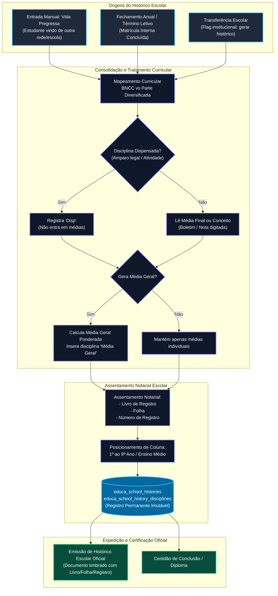

# Fluxo de Histórico Escolar (Vida Pregressa e Fechamento Anual)

```mermaid
flowchart TD
    %% Nós de Origem
    subgraph S1["Origens do Histórico Escolar"]
        O_MAN["Entrada Manual: Vida Pregressa<br/>(Estudante vindo de outra rede/escola)"]
        O_SYS["Fechamento Anual / Término Letivo<br/>(Matrícula Interna Concluída)"]
        O_TRF["Transferência Escolar<br/>(Flag institucional: gerar histórico)"]
    end

    %% Processamento / Consolidação
    subgraph S2["Consolidação e Tratamento Curricular"]
        P_CONV["Mapeamento Curricular<br/>BNCC vs Parte Diversificada"]
        P_DISP{"Disciplina Dispensada?<br/>(Amparo legal / Atividade)"}
        P_DISP_SIM["Registra 'Disp'<br/>(Não entra em médias)"]
        P_DISP_NAO["Lê Média Final ou Conceito<br/>(Boletim / Nota digitada)"]
        
        P_MED{"Gera Média Geral?"}
        P_MED_SIM["Calcula Média Geral Ponderada<br/>Insere disciplina 'Média Geral'"]
        P_MED_NAO["Mantém apenas médias individuais"]
    end

    %% Registro Oficial e Notarial
    subgraph S3["Assentamento Notarial Escolar"]
        REG_LIVRO["Assentamento Notarial:<br/>- Livro de Registro<br/>- Folha<br/>- Número de Registro"]
        REG_POS["Posicionamento de Coluna:<br/>1º ao 9º Ano / Ensino Médio"]
        REG_HIST[("educa_school_histories<br/>educa_school_history_disciplines<br/>(Registro Permanente Imutável)")]
    end

    %% Emissão e Certificação
    subgraph S4["Expedição e Certificação Oficial"]
        EXP_PDF["Emissão de Histórico Escolar Oficial<br/>(Documento timbrado com Livro/Folha/Registro)"]
        EXP_CERT["Certidão de Conclusão / Diploma"]
    end

    %% Relacionamentos
    O_MAN --> P_CONV
    O_SYS --> P_CONV
    O_TRF --> P_CONV

    P_CONV --> P_DISP
    P_DISP -- Sim --> P_DISP_SIM --> P_MED
    P_DISP -- Não --> P_DISP_NAO --> P_MED

    P_MED -- Sim --> P_MED_SIM --> REG_LIVRO
    P_MED -- Não --> P_MED_NAO --> REG_LIVRO

    REG_LIVRO --> REG_POS --> REG_HIST
    REG_HIST --> EXP_PDF
    REG_HIST --> EXP_CERT

    classDef origin fill:#1e293b,stroke:#38bdf8,stroke-width:2px,color:#f8fafc;
    classDef proc fill:#0f172a,stroke:#818cf8,stroke-width:2px,color:#f8fafc;
    classDef db fill:#0369a1,stroke:#38bdf8,stroke-width:2px,color:#ffffff;
    classDef out fill:#064e3b,stroke:#34d399,stroke-width:2px,color:#ffffff;

    class O_MAN,O_SYS,O_TRF origin;
    class P_CONV,P_DISP,P_DISP_SIM,P_DISP_NAO,P_MED,P_MED_SIM,P_MED_NAO,REG_LIVRO,REG_POS proc;
    class REG_HIST db;
    class EXP_PDF,EXP_CERT out;
```
