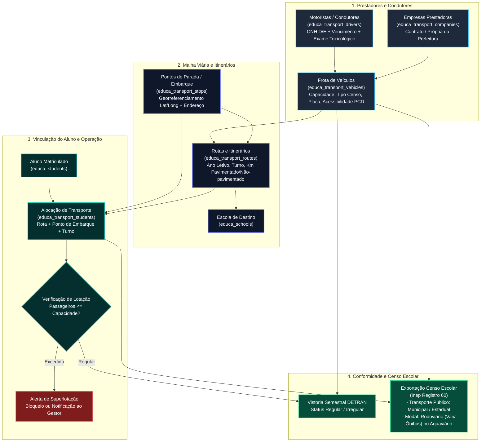

# Fluxo de Transporte Escolar (SYS-Educa / SYSGOV)

```mermaid
flowchart TD
    %% Cadastros de Infraestrutura
    subgraph S1["1. Prestadores e Condutores"]
        EMP["Empresas Prestadoras<br/>(educa_transport_companies)<br/>Contrato / Própria da Prefeitura"]
        MOT["Motoristas / Condutores<br/>(educa_transport_drivers)<br/>CNH D/E + Vencimento + Exame Toxicológico"]
        VEI["Frota de Veículos<br/>(educa_transport_vehicles)<br/>Capacidade, Tipo Censo, Placa, Acessibilidade PCD"]
    end

    %% Definição de Malha e Logística
    subgraph S2["2. Malha Viária e Itinerários"]
        PON["Pontos de Parada / Embarque<br/>(educa_transport_stops)<br/>Georreferenciamento Lat/Long + Endereço"]
        ROT["Rotas e Itinerários<br/>(educa_transport_routes)<br/>Ano Letivo, Turno, Km Pavimentado/Não-pavimentado"]
        ESC["Escola de Destino<br/>(educa_schools)"]
    end

    %% Vinculação e Lotação
    subgraph S3["3. Vinculação do Aluno e Operação"]
        ALU["Aluno Matriculado<br/>(educa_students)"]
        VINC["Alocação de Transporte<br/>(educa_transport_students)<br/>Rota + Ponto de Embarque + Turno"]
        CHECK_LOT{"Verificação de Lotação<br/>Passageiros <= Capacidade?"}
        ALERTA_LOT["Alerta de Superlotação<br/>Bloqueio ou Notificação ao Gestor"]
    end

    %% Fiscalização e Censo
    subgraph S4["4. Conformidade e Censo Escolar"]
        VIST["Vistoria Semestral DETRAN<br/>Status Regular / Irregular"]
        CENSO["Exportação Censo Escolar<br/>(Inep Registro 60)<br/>- Transporte Público: Municipal / Estadual<br/>- Modal: Rodoviário (Van/Ônibus) ou Aquaviário"]
    end

    %% Relacionamentos
    EMP --> VEI
    MOT --> VEI
    PON --> ROT
    ROT --> ESC
    VEI --> ROT

    ALU --> VINC
    ROT --> VINC
    PON --> VINC
    VINC --> CHECK_LOT
    CHECK_LOT -- Excedido --> ALERTA_LOT
    CHECK_LOT -- Regular --> VIST

    VEI --> VIST
    VINC --> CENSO
    VEI --> CENSO

    classDef infra fill:#1e293b,stroke:#38bdf8,stroke-width:2px,color:#f8fafc;
    classDef route fill:#0f172a,stroke:#818cf8,stroke-width:2px,color:#f8fafc;
    classDef student fill:#042f2e,stroke:#2dd4bf,stroke-width:2px,color:#f8fafc;
    classDef censo fill:#064e3b,stroke:#34d399,stroke-width:2px,color:#ffffff;
    classDef alert fill:#7f1d1d,stroke:#f87171,stroke-width:2px,color:#ffffff;

    class EMP,MOT,VEI infra;
    class PON,ROT,ESC route;
    class ALU,VINC,CHECK_LOT student;
    class VIST,CENSO censo;
    class ALERTA_LOT alert;
```
